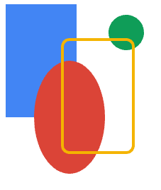

# RSkity

Rskity is an other wheel of 2D vector graphic rendering project which I used to learn `rust` and `wgpu`. It is currently in the early stages of development, hoping one day I can publish it.

## Usage

```rust

use rskity::{core::*，gpu::GPUContext}

// record draws into Picture
let picture = {
    let mut recorder = PictureRecorder::new();

    let mut paint = Paint::new();

    paint.color = Color::from_rgba_u8(0x42, 0x85, 0xF4, 0xFF);
    let rect = Rect::from_xywh(10.0, 10.0, 100.0, 160.0);
    recorder.draw_rect(&rect, &paint);

    let mut oval = RRect::new_oval(rect);
    oval.offset(40.0, 80.0);
    paint.color = Color::from_rgba_u8(0xDB, 0x44, 0x37, 0xFF);
    recorder.draw_rrect(&oval, &paint);

    paint.color = Color::from_rgba_u8(0x0F, 0x9D, 0x58, 0xFF);
    recorder.draw_circle(180.0, 50.0, 25.0, &paint);

    paint.style = Stroke::default().with_width(4.0).into();
    paint.color = Color::from_rgba_u8(0xF4, 0xB4, 0x0, 0xFF);

    let mut rrect = RRect::from_rect_xy(rect, 10.0, 10.0);
    rrect.offset(80.0, 50.0);
    recorder.draw_rrect(&rrect, &paint);

    recorder.finish_record()
};

// after picture created it can be replied and flush onto a wgpu::Texture
let (device: wgpu::Device, queue: wgpu::Queue) = ... ; // init wgpu context
let texture : wgpu::Texture = ...; // create by yourself

let context = GPUContext::new(&device);

let mut surface = Surface::new(&text.texture, texture.width(), texture.height(), true, device);

surface.replay(&picture);
surface.flush(&mut context, &device, &queue, Some(wgpu::Color {
                r: 1.0,
                g: 1.0,
                b: 1.0,
                a: 1.0,
            }));


```



## Current status:

- Geometry Shape support (Fill, Stroke)

- Path Clip

- Basic transform (translation, scaling, rotation)

## TODO

- [ ] Gradient Color

- [ ] Draw Image

- [ ] Text rendering

- [ ] PathEffect support (dash ... etc)

- [ ] Blur mask filter

- [ ] Advance blending
